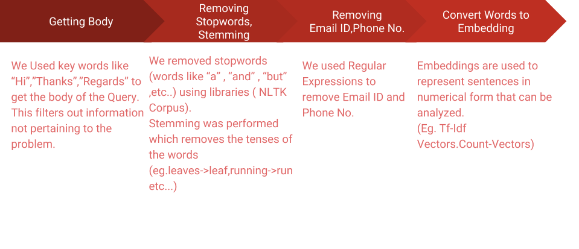
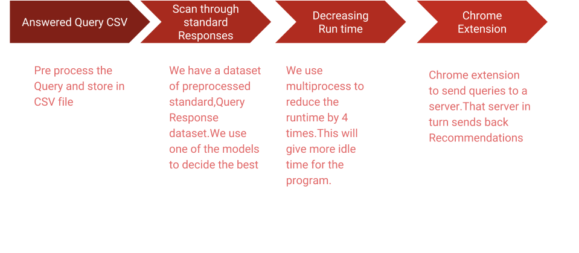

# Response-Recommendation
Recommend response to queries based on a established query-response table 

## Data Flow


## How the program runs?



## Different Methods Used

```
* Cosine Similarity With Tf-idf Vectors
* K-means clustering with doc2vec vectors
* Two LSTM with Tf-idf 
```

### Cosine Similarity with Tf-idf Vectors
 1. Create a corpus of query-response words.
 2. Create Count Vector for the corpus and from it Tf-idf vectors
 3. Iterate through training set to find example with minimum cosine distance and suggest the corresponding response.

### K-means clustering with doc2vec vectors

1. Create a Doc2Vec and model and train it.
2. Calculate sentence vectors of Queries from trained model
3. Perform K-Means Clustering on trained data.
4. Give corresponding response of the queries in which test query belongs to.

[Link to paper on the two LSTM approach](https://arxiv.org/pdf/1707.01378.pdf)

### Extension 
The purpose of the extension is so that it sends a POST request of a highlited text(in our case the query for which response is requires) to our server
which inturn gives back the suggested response.
